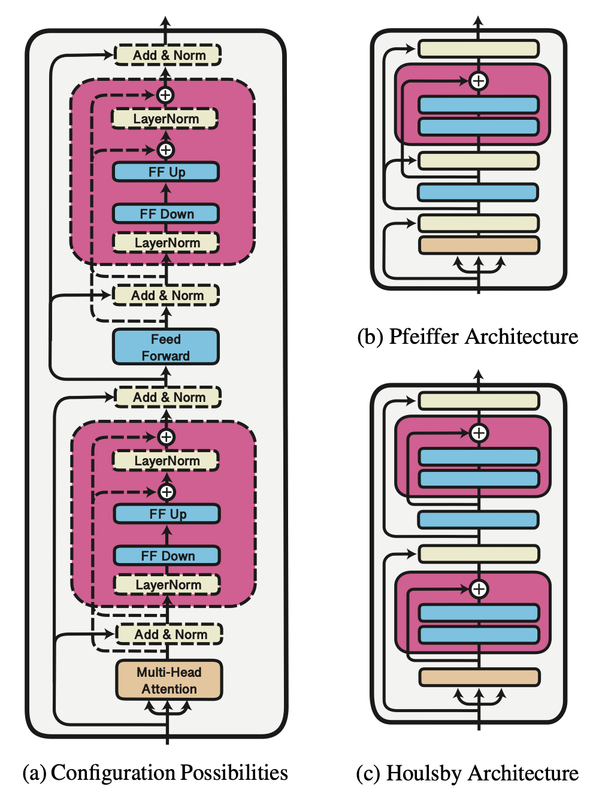

# Transformers with Adapters

## Objective

Build a model which can translate multiple Indian languages to english very efficiently & reduce language specific weights as much as possible.

## Picking initial model

### Why pretrained model?

Indian languages are low resource so we need a model which can understand language structure & relate information before hand nicely so that during training for translation task it can just focus on how to translate and not on understanding each language structure. This way we can work with small data and may get benefitted from other languages (involved during pretraining stage).

### Which pretrained model & Why hard to re-use existing pretrained model?

Pretrained model must support the languages which we want to involve during translation task i.e it must have seen that language during pre-training. Also pre-trained model should be seq2seq model and hence should be like encoder-decoder architecture.

Using existing pre-trained models is not an easy task. Among so many pretrained models, it's generally hard to decide which one to use. Also many of the pretrained models are english based, so its hard to find model which has seen required language during pre-training stage.

Here, let's remain specific to pretrained models for Indian-languages. We had various possible options like IndicBERT (AlBERT like model), mBART and many more.

**IndicBERT:** It is a encoder-only model which was trained on multiple Indian languages using BERT objective. Checkpoint for this model can be found [here](https://huggingface.co/ai4bharat/indic-bert). Since our task is of text generation, we need encoder-decoder like architecture to be able to do this task. One of the way to proceed is to simply stack mBART-Decoder over the IndicBERT model and tune this pair for our task. This experiment is out of scope of this article, but we encourage one to perform these kinda experiments and make better use of pretrained-encoder only models. Some papers claims this kinda approach to be quite effective. You can surely refer [this](https://arxiv.org/abs/1907.12461) in case you want to find more about it.

**mBART:** It's an encoder-decoder model which is pretrained to denoise multiple languages simultaneously. This way it has captured most of the information of multiple languages and good at tasks involving text generation. We introduced adapters in this model at various locations and decided to fine-tune only adapters to adapt the model (initiated from this [checkpoint](https://huggingface.co/facebook/mbart-large-cc25)) for translation of particular language pair; thus preserving almost all of the information, it has gained during pre-training.

Further described experiments are all about mBART with adapters at appropriate positions.

## Fine-tuning from scratch

Before going deeper into adding adapters, let's begin with the most simplest approach i.e. to fine-tune it on each language pair separately. This approach will be very inefficient in terms of memory since we need to save weights of all bi-lingual models.

Eg: lets say, we want translation model for 5 language pairs: `hin-eng`, `guj-eng`, `tamil-eng`, `bengali-eng`, `marathi-eng`. mBART finetuned on each dataset will have around `2.5 GB of weights / language-pair`. So, for these 5 language pairs, we will be having `2.5 x 5 = 12.5 GB` of weights. Guess, how much memory Google translator will need this way (remember it covers > 100 langugages). We need to find way to increase memory efficiency without compromising the performance on each dataset. We will discuss solutions to this in coming sections.

One more thing to note is that there will be lot of common information among multiple Indian language pairs like language structure of hindi & gujarati are more similar as compared to hindi & eng. This important property can be considered while planning the strategy to train the model.

We have reported the result for complete-finetuning in table presented in later section & made a nice comparison with cases of adapter addition.

## Adapters

</img>

Adapters are small feed-forward like network which aims to adapt any pre-trained model to required task without changing weights of the pre-trained layers. Therefore, adapters should give the same output which we would have got by fine tuning that pre-trained layer.

**Benefits:** Adding adapters will limit the language-pair specific weights to the number of parameters introduced by small feed-forward network at many locations.

**Extending previous example:**

```md
Adapter weights per lanugage pair = 300 MB

For all 5 language pairs: 5 x 300 = 1.5 GB

Pretrained weights: 2.5 GB

Total weights: 1.5 + 2.5 = 4 GB
```

Previously, total weights were 12.5 GB and now it is 4 GB only. We have reduced 68% of space. Now consider the scenerio when we have 100's of such language pair. Most importantly we are able to do this without compromising our performance. We will compare results in next section.

TOO MUCH EFFICIENT RIGHT!

### Where to add adapters?

Where to add adapters is very generic question & one can't really answer this question without testing it; because location of adapters depends on pre-training strategy and how much particular task is related to the pre-training strategy.

Hence, this is a possible reason why most papers on Adapters suggest to add adapters after feed-forward layer in both encoder and decoder. Some papers include adapters after self-attention layer also.

Since adapters major role is to adapt each pretrained layer to what it was expected if we would have done complete fine-tuning (approximate way to understand i guess 😉), It should be nice to figure out what all layers are really changing when pretrained model is fine-tuned on our task.

### Our Experiments

We experimented by freezing some of the layer and tried to visualize how much results are varying after/before freezing that partiular layer. If loss function & final bleu score is not changing much (as compared to complete fine-tuning) by freezing that particular layer, then that layer possibly doesn't need adapter. We tried to restrict our attention to self-attention / cross attention, ffn, embedding layer and conducted these experiments for these layers. Based on the idea developed from this, we started adding adapters after layers which were changing much. Below table summarizes some of our experiments.

| Experiment details (20 K samples)                      | Time taken (on Colab T4) | tr_bleu | val_bleu |
|--------------------------------------------------------|--------------------------|---------|----------|
| train dec-ffn-adapter, enc-attn-adapter, embed-adapter | 1h 6m 31s                | 13.991  | 12.54    |
| + enc-ffn-adapter                                      | 1h 8m 40s                | 10.031  | 9.233    |
| + dec-attn-adapter                                     | 1h 10m 34s               | 6.836   | 6.312    |
| + cross-attn-adapter                                   | 1h 9m 52s                | 2.039   | 2.022    |

| Experiment details (50 K samples)                      | Time taken (on Colab T4) | tr_bleu | val_bleu |
|--------------------------------------------------------|--------------------------|---------|----------|
| train dec-ffn-adapter, enc-attn-adapter, embed-adapter | 2h 3m 1s                 | 18.391  | 17.26    |
| + enc-ffn-adapter                                      | 2h 13m 14s               | 3.511   | 3.425    |
| + dec-attn-adapter                                     | 2h 9m 37s                | 8.109   | 7.589    |
| + cross-attn-adapter                                   | 2h 7m 8s                 | 12.233  | 11.42    |

| Experiment details (100 K samples)                     | Time taken (on Colab T4) | tr_bleu | val_bleu |
|--------------------------------------------------------|--------------------------|---------|----------|
| train only embed-adapter                               | 4h 13m 2s                | 15.725  | 15.278   |
| + dec-ffn-adapter                                      | 4h 31m 20s               | 21.082  | 19.701   |
| + enc-attn-adapter                                     | 4h 31m 0s                | 13.932  | 13.126   |
| + dec-attn-adapter, enc-ffn-adapter                    | 4h 27m 25s               | 9.365   | 8.652    |
| Complete tuning                                        | 5h 54m 36s               | 19.833  | 19.049   |

**Inference:** We observed that in case of tuning mBART for translation task, best adapter configuration is adding it after `encoder self-attention`, `decoder feed-forward network` & after `embedding layer`. We can clearly see from the table that adding adapter after embedding layer is very important and can improve the model's performance by significant amount. Training only the embedding adapters fetch us 15 bleu score while if we train any other adapter, bleu is increasing by little amount.

We can clearly see from the table that our best adapter case is performing very similar to complete tuning case while there is a significant difference in training time. We will be considering our best adapter configuration for further analysis.

## Deciding hyper-parameters during model training

Unlike transformers which are recommended to train at low learning rate (orders of 1e-5 generally), we observed that adapters takes lot of time to converge at learning rate of this order. After some experiments, we found that for training adapters, learning rate should be in orders of 1e-3 to be able to get convergance in decent time.

Since adapters are saving lots of memory during training (since gradient calculation is never made for many layers during training), we can have bigger batch sizes and hence fast training on bigger datasets.

### Should we train Adapters & pretrained model simultaneously

We have observed that model performs very bad when adapters and pretrained weights are trained simultaneously. Our hytothesis is that since adapters are introduced after each layer of transformer, weights of every successive layer are getting destroyed because adapters are randomly intialized.

One important question arises here is how to intitalize the adapters. One possible initialization strategy can be to make identity function. We leave this question untouched for the researchers to figure out. We beleive that better initialization of adapters can take pretrained models world to a new era.

## End Notes

* Thanks to [**Dr. Nishant Sinha**](https://github.com/ekshaks) for guiding me throughout the project and helping me to grow in the world of transformers.
* Thanks to [**Hugging Face**](https://huggingface.co) team for building such an awesome library for easy & quick experimentation with transformers.

## References

* Simple, Scalable Adaptation for Neural Machine Translation [[Paper](https://www.aclweb.org/anthology/D19-1165.pdf)]
* Pivot-based Transfer Learning for Neural Machine Translation between Non-English Languages [[Paper](https://www.aclweb.org/anthology/D19-1080.pdf)]
* Parameter-efficient Transfer Learning for NLP [[Paper](https://arxiv.org/pdf/1902.00751.pdf)]
* Domain-Adaptation of Pretrained Language Models [[Paper](https://arxiv.org/abs/2004.03354)]
* MAD-X: An Adapter-based Framework for Multi-task Cross-lingual Transfer [[Paper](https://public.ukp.informatik.tu-darmstadt.de/MAD-X/paper.pdf)]
* AdapterHub: A Framework for Adapting Transformers [[Paper](https://arxiv.org/abs/2007.07779)] [[Code](https://github.com/Adapter-Hub/adapter-transformers)]
* Investigate Multiling NMT Representations [[Paper](https://arxiv.org/abs/1909.02197)]
* Massively Multilingual Neural Machine Translation [[Paper](https://arxiv.org/pdf/1903.00089.pdf)]
* A study of attention-based Neural Machine Translation models on Indian Languages [[Paper](https://www.aclweb.org/anthology/W16-3717.pdf)]
* bhasha dataset [[Link](http://preon.iiit.ac.in/~jerin/bhasha/)]
* IITB hin-eng parallel dataset corpus [[Link](https://www.cfilt.iitb.ac.in/~parallelcorp/iitb_en_hi_parallel/)]
